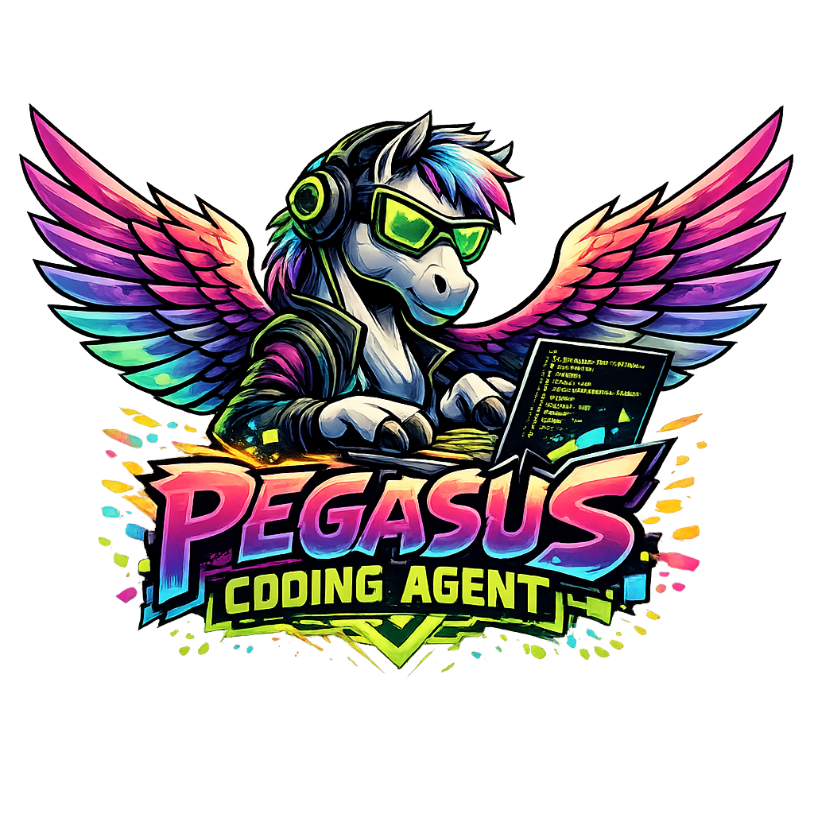

## Pegasus:  Modular Agent Runtime For Buiding Long Running Agents

  

## Introduction
Pegasus is a set of modular building blocks used to compose agent runtimes for different usecases. 
Imaging if you could hierarchically view all the features of claude code's runtime and compose it into a unique structure that fits your application usecase. That is Pegasus aims to acheive